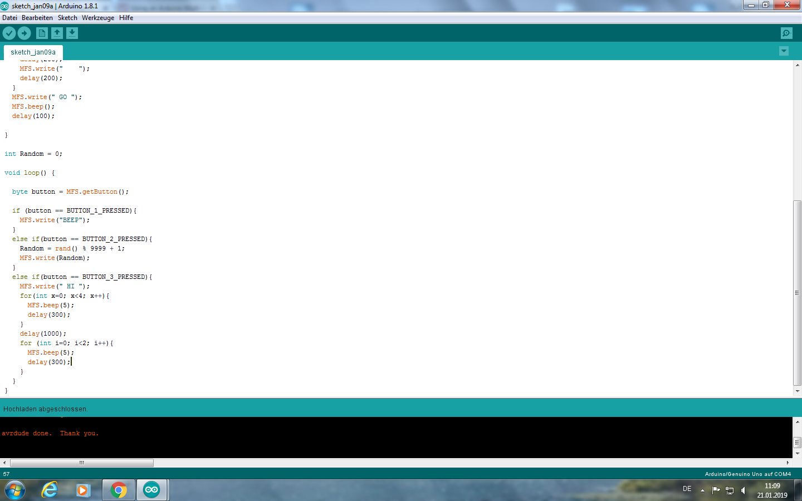
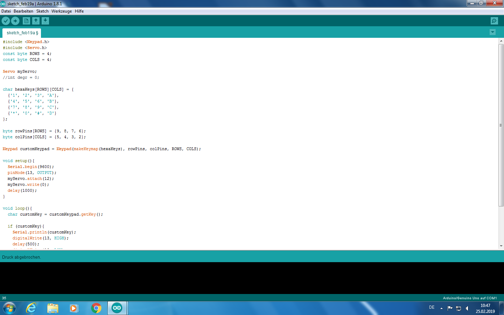

# Arduino-Uno

## 17/12/2018
Wir haben an einen Arduino Uno eine LED angeschlossen und mit der Hilfe von Lukas Instruktionen diese zum leuchten gebracht.

## 18/12/2018
Wir haben uns im Internet über das "multifunction shield" informiert. Beim Versuch einen kopierten Code hochzuladen ist ein Fehler aufgetreten, welchen wir beheben mussten. Dazu mussten wir mehrere Bibliotheken runterladen. Anhand des kopierten Codes haben wir die bereits vorher auf dem Display abgebildete 0 auf selbigem verschoben.

## 08/01/2019
In dem YouTube-Video <a href="https://www.youtube.com/watch?v=X7T5sfrgprU">Arduino Multi function Shield</a> haben wir uns über das multi-function shield und seine Funktionen informiert. Wir haben die in dem Video verwendete <a href="https://www.mpja.com/download/hackatronics-arduino-multi-function-shield.pdf">PDF-Datei</a> geöffnet und den Code unter dem Punkt: "Writing to the shield’s digit display" kopiert und ausgeführt und anhand dessen den Befehl für die Darstellung eines Wortes auf dem Display ermittelt. Im Anschluss daran haben wir, wie bei einer Leuchtreklame "LADE" von rechts nach links durchlaufen lassen. 
Code:

MFS.write("    "); 
delay(200); 
MFS.write("   L"); 
delay(200); 
MFS.write("  LA"); 
delay(200); 
MFS.write(" LAD"); 
delay(200); 
MFS.write("LADE"); 
delay(200); 
MFS.write("ADE "); 
usw.}

## 14/01/2019
Am Wochenende hat Thore zuhause versucht ein kleines Programm zu schreiben, welches noch leicht fehlerhaft war. Dieses haben wir dann heute überarbeitet und den Fehler behoben. In dem Programm läuft von rechts nach links das Wort "Lade" drei mal durch. Ist dies abgeschlossen, so erscheint auf dem Display das Wort "Go" und das multi-function shield piept kurz auf. 
Code für Piep: 
MFS.beep(); 
delay(1000);

## 15/01/2019
Ich (Thore, da Jonathan krank ist) habe heute mich mit den Knöpfen auseinander gestezte und dem gestrigen Programm ein kleines Add-On verpasst, welches bewirkt, dass man nachdem das Display "Go" schreibt man auf den <b>ersten Knopf</b> drücken kann und der Arduino ein Piepen von sich gibt, sowie "Beep" auf dem Display erscheint. Drückt man den <b>zweiten Knopf</b>, so erhält man auf dem Display eine zufällige Nummer von 1 bis 9999. Mit einem Druck auf den <b>dritten und letzten Knopf</b> ehält man ein freundliches "Hi". Dies gilt sowohl für das Display, alsauch für den Pieper, welcher dieses morst.

## 21/01/2019
Das Programm, welches Thore geschrieben hatte, haben wir rekonstruiert, da dies auf seinem Laptop geschrieben wurde, und genauere Ideen für ein endgültiges Projekt entworfen.

## 22/01/2019
Heute hebn wir versucht eine Stoppuhr zu programmieren. Dies hat allerdings in der Ausführung nicht funtioniert, da wir scheinbar einen Logikfehler gemacht haben.

## 29/01/2019
Wir haben die Ideen für das multi-function shield über Bord geworfen und uns dazu entschieden einen Kran zu bauen, der auf einem Servo steht und eine Seilwinde hat. Außerdem haben wir versucht einen Servo mit dem seriellen Monitor zu steuern, was jedoch nicht funktioniert hat.

## 12/02/2019
Heute haben wir eine Lösung für das Problem gefunden: indem wir ein 4x4 Tasten-Feld nutzen wollen wir die Steuerung des Krans ohne Eingabe am PC bewerkstelligen. Außerdem haben wir dieses angeschlossen und uns mit seiner Funktionsweise auseinander gesetzt.http://www.circuitbasics.com/how-to-set-up-a-keypad-on-an-arduino/

## 19/02/2019
Heute haben wir an den Arduino das Keypad angeschlossen und den Tasten einzelne Funtionen zugewiesen. So leuchtet bei jedem Tastendruck  eine LED auf. Jedoch unterscheidet sich die Dauer und Häufigkeit des Leuchtens sich von Taste zu Taste.

## 25/02/2019
Am Anfang der Stunde haben wir das Abgabedatum besprochen. Bei dem Versuch das Keypad an den Arduino anzuschließen, ist ein Fehler aufgetreten. Dieser bestand darin, dass die Tasten gespiegelt waren. Die Spiegelachse verlief hierbei über die Tasten: *,8,6 und A. Um dieses Problem zu beheben, haben wir im Programm die Tastenbelegung so geändert, dass den Tasten die richtigen Werte zugeordnet waren. Außerdem haben wir uns dazu entschlossen, einen Roboterarm zu bauen.

## 26/02/2019
Erst haben wir überlegt, wie wir die Servos einzeln ansteuern. Wärend der Überlegungen wurden wir dazu angeregt, dass wir einen meArm verwenden könnten. Mit Rücksichtsnahme auf die Zeit haben wir uns dazu entschlossen diese Gelegenheit warzunehmen. Im Internet haben wir uns dann Informationen zum Programmieren eines meArms angeeignet. Des weiteren gab es einen <a href= "https://github.com/yorkhackspace/meArm/tree/master/examples">Beispiel-Code</a> und eine <a href= "https://github.com/yorkhackspace/meArm/blob/master/meArm.h">Library</a> für den meArm, welche wir uns heruntergeladen haben.

## 04/03/2019
Heute haben wir uns mit den meArm Libraries auseinander gesetzt, da wir noch keinen meArm Vorliegen haben, mit welchem wir arbeiten könnten. Anhand dessen haben wir beispielsweise herausgefunden, dass der erste Pin für die Basis, der Zweite für die Schulter, der Dritte für den Ellbogen und der Vierte für den Greifer ist.

## 05/03/2019
Mit Ausprobieren haben wir herausgefunden, welche Winkel auf dem Servo am Greifer maximal bzw. minimal eingestellt werden dürfen (max. 132 und min. 83 Grad). Des Weiteren haben wir uns Möglichkeiten überlegt, wie man den meArm steuern kann. Hierbei haben wir auch auf Code aus der bereits genannten Datei zugegriffen.

## 18/03/2019
Heute haben wir die Steuerung für den meArm programmiert und den Code, welchen wir übernommen haben markiert.

## 25/03/2019
Da am 26.03.2019 das Stundenprotokoll abgegeben werden muss, haben wir heute dieses überarbeitet, sowie an der Projektseite weitergearbeitet.

## 26/03/2019
Wir haben heute den meArm an den Arduino angeschlossen und festgestellt, dass die eine 5V-Quelle des Arduinos nicht ausreicht, um die vier Servo zu betreiben. Des Weiteren haben die Servos zwar das Signal empfangen, dass von dem Keypad an den Arduino und von dem Arduino an die Servos gehen soll, jedoch haben sie die Informationen nur teilweise, langsam und sehr ruckelig verarbeitet wurden.

## 10/04/2019
Thore hat heute die Anweisung Herrn Buhls befolgt und nach dem Motto "Prove of Concept" einen Code geschrieben, um mit dem Keypad und dem Aruino wenigstens einen Servo anzusteuern.

## 11/04/2019
