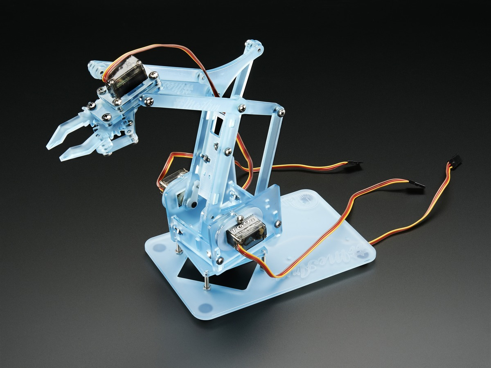

# meArm

## Gliederung
[Einführung](#einf) 
[Code](#code) 
[Projektverlauf](#verl) 

### Einführung
Der meArm ist ein Miniatur-Roboterarm, welcher mit einem kleinen Controllerboard, wie einem Raspberry Pi oder in diesem Fall einem Arduino, gesteuert werden kann. Er setzt sich aus mehreren laser-geschnittenen Plastik- oder Holzteilen und vier Servos zusammen.

Diese Servos werden von dem Arduino über einen PWM-Pin angesteuert und mit einer 5V-Spannung versorgt. Da der Arduino aber nur zwei Erdungen hat und nur einen 5V-Pin, muss man mit einem Steckbrett die Versorgung verteilen.

### Code

### Projektverlauf
