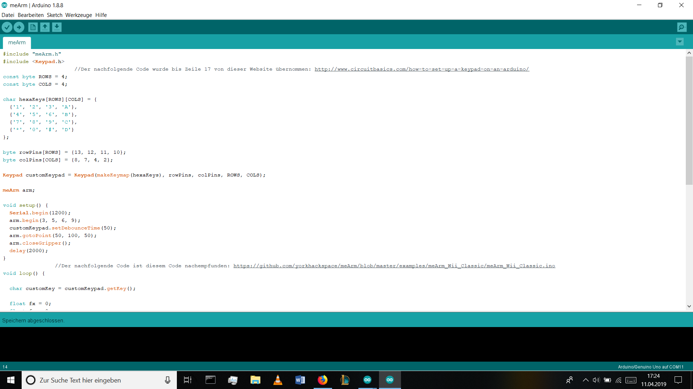
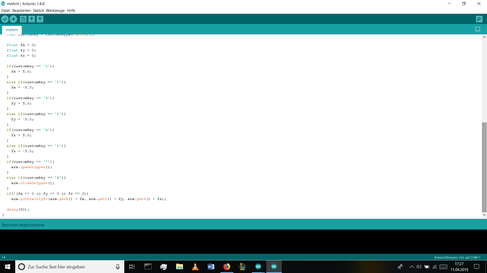
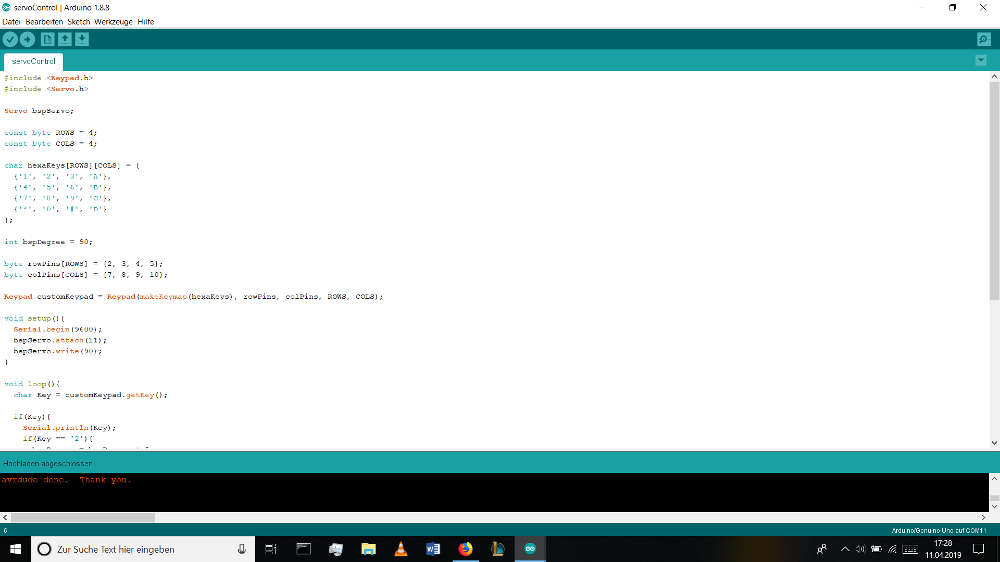
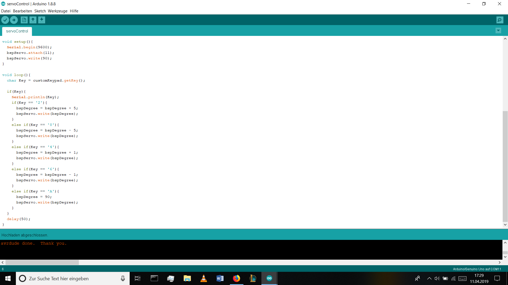

# meArm

## Gliederung
[meArm und Keypad](#einf) 
[Projektverlauf](#verl) 
[Code](#code) 

### meArm und Keypad
Der meArm ist ein Miniatur-Roboterarm, welcher mit einem kleinen Controllerboard, wie einem Raspberry Pi oder in diesem Fall einem Arduino, gesteuert werden kann. Er setzt sich aus mehreren laser-geschnittenen Plastik- oder Holzteilen und vier Servos zusammen.

Diese Servos werden von dem Arduino über einen PWM-Pin angesteuert und mit einer 5V-Spannung versorgt. Da ein 5V-Pin nicht ausreicht, muss man mit einem Steckbrett eine externe 9V-Stromquelle anschließen. Um den meArm zu kontrollieren kann man verschiedenste Kontrollmittel, wie Joysticks oder Tastenfelder verwenden. 
Das Keypad setzt sich aus 4x4 Knöpfen zusammen und hat 8 Pinanschlüsse. Auf vier dieser Pins, genauer gesagt die vier Pins der Spalten, wird ein Signal ausgegeben. Wenn nun einer der 16 Knöpfe gedrückt wird bricht das Signal der Spalte dieses Pins ab, was vom Arduino regisrtiert und vermerkt wird. Dieser stoppt die Signale auf den Pins der Spalten und  gibt nacheinander Signale auf den Pins der Reihen aus. Wird nun ein Signal auf dem Pin der Spalte, auf welcher vorher das Signal durch den Knopfdruck entfiel, empfangen, so steht die Position des Knopfs fest und  damit auch der Wert.

### Projektverlauf
Uns war schnell klar, dass wir bei unserem zweiten Projekt physisch programmieren wollten. Dabei haben wir uns für den Arduino entschien, da er als Einstieg sehr gut geeignet sein soll. Um uns mit dem Arduino und C++ vertraut zu machen haben wir anfänglich unter Anderem mit einem Multi-Funktions-Schild, zu welchem einige Beispielcodes zu finden waren, herumexperimentiert. Da aber für unsere Ideen dafür schon verschidenste Codes vorhanden waren, haben wir uns entschiden mit dem 4x4 Tastenfeld einen selbstgebauten Kran zu kontrolliern. Wir haben uns dann auf den Rat von unserem Lehrer hin dazu entschieden, seinen meArm zu verwenden, weil die Zeit für einen selbstgebauten Kran oder Roboterarm nicht gereicht hätte. Danach haben wir uns mit der Bedienung und Funktionsweise des Keypads auseinander gesetzt. Danach haben wir uns mit der Ansteuereung des meArms beschäftigt. Sobald wir beides verstanden hatten, haben wir einen Code geschrieben, der beides kombinieren sollte und danach alles angeschlossen. Hierbei ist uns das Problem der mangelnden Spannung auf Grund des Fehlens einer externen Stromquelle aufgefallen. Daher haben wir einen Code geschrieben, mit welechem man nur einen Servo ansteuert.

### Code
Der Code zur Bedienung des meArm setzt sich im Wesentlichen aus zwei Teilen zusammen. Das ist zum einen die Einrichtung des Keypads, welche die Zuweisung von Werten den Tasten ihrer Position nach und die Definition des Keypads als Objekt beinhaltet.

Zum anderen wäre das ein Positionsechsel des Arms auf Tastendruck, wobei jedem Tastenwert eine Schrittweite in einem imaginären Koordinantensystem zugewiesen wird.

Um nur einen Servo anzusteuern muss man ebenfalls erst das Keypad als Objekt definieren, und den Tasten einen Wert zuweisen, sowie ein Servo-Objekt erstellen und dieses an einen PWM-Pin anschließen.

Und anschließend den Werten des Keypads Schrittweiten in Grad oder feste Positionen zuweisen.

